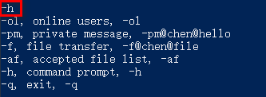

# 聊天室说明

[toc]

## 题目要求

本项目是基于 Tcp/Udp 的网络通信项目，其设计要求如下：

1.采用 Java 语言开发
2.可以和指定用户聊天：不超过 100 个用户
3.可以和指定用户上传、下载文件，可以多个文件、多用户间并行传输，有开始、结束时间、耗时统计，打印关键日志
4.独立双通道机制：命令交互使用 UDP，文件传输使用 TCP，相互不能阻塞，能启动、取消下载
5.需要考虑弱网环境：即 UDP 丢包，TCP 慢等情况

限制要求：

1. 使用 Java 的基本 socket 类，不要使用 Netty 等 socket 框架，采用下面 2 种：
   - TCP:java.net.Socket
   - UDP:java.net.DatagramSocket
2. 检测对方离线：上线、离线打印关键日志

本项目基本满足以上要求

## 架构

聊天室采用 C/S 架构：

- 服务器：
  - TCP 监听用户连接：用户登录以后与服务器连接，保持登录状态
  - UDP 响应用户命令：用户通过命令字向服务器进行请求
  - TCP 心跳检测：持续与用户发送心跳包，检测用户状态
- 客户端：
  - 查看在线用户：`-ol`
  - 私聊用户：`-pm@chen@hi`，表示向 `chen` 发送了一条 `hi` 信息
  - 查看接收文件：`-af`，查看用户目录下接收的文件列表
  - 文件传输：`f@chen@file`，表示向 `chen` 发送了文件 `file`
  - 查看命令提示：`-h`
  - 退出：`-q`

## 实现原理

用户登录：

- 用户输入信息：用户名、TCP 监听端口、UDP 收发端口
- 启动本地服务：与服务端的 TCP 和 UDP 连接
- 创建用户目录：存放用户接收的文件
- 通过 TCP 传送用户信息到服务器注册
- TCP 广播上线信息

查看在线用户：

- 客户端发送命令字
- 服务器将维护的用户列表返回

私聊用户：

- 向服务器获取私聊用户的相关信息
- 服务器将该用户的信息返回
- 收到以后建立与该用户的 UDP 收发通道

查看接收文件：

- 返回用户目录下的文件列表

文件传输：A -> B 传

- 向服务器获取 B 用户信息
- 服务器将 B 用户的信息返回给 A
- A 发送启动监听的命令给 B
- B 启动 TCP 监听准备接收文件
- A 连接 B 的 TCP 端口传送文件

退出：

- 用户给服务器发送退出命令字
- 服务器移除该用户的相关信息
- 广播用户下线信息

心跳检测：

- 服务器启动一个心跳检测线程
- 间隔的给用户发送心跳包
- 收到反馈说明用户在线
- 反之将其连接清除

## 命令字说明

总共包含 9 个命令：

```
ONLINE_USERS("-ol", "online users", "-ol"), // 查看在线用户
PRIVATE_MSG("-pm", "private message", "-pm@chen@hello"),  // 私信
FILE_TRANSFER("-f", "file transfer", "-f@chen@file"),   // 传输文件
ACCEPTED_FILES("-af", "accepted file list", "-af"),   // 获取接收文件列表
EXIT("-q", "exit", "-q"),   // 退出客户端
START_LISTEN("-sl", "start listen", "-sl"),   // 启动监听接收文件
SOUT("-sout", "output", "-sout@content"),   // 直接输出该命令所附带的信息
HELP("-h", "command prompt", "-h"),   // 命令提示
NEW_CHANNEL("-nc", "New channel", "-nc@content");   // 创建新的聊天通道
```

## 功能展示

### 服务器启动


### 客户端登录

目前没有对用户名进行重名限制，所以在测试过程中需要注意不要输入相同的名字。

端口有进行检测，一旦发现端口不可用会重新输入。


### 查看在线用户


### 私聊用户

发送方：


接收方：


### 文件传输

发送方：展示传送文件名、文件大小、起始时间和消耗时间


接收方：展示接收文件名，文件大小，存储位置，起始时间和文件消耗


### 查看接收文件

本命令是查看其用户目录下的文件，即接收的文件


### 查看命令提示



### 退出

由于服务器有心跳检测，所以不管是什么形式的退出，服务器都可以感知


